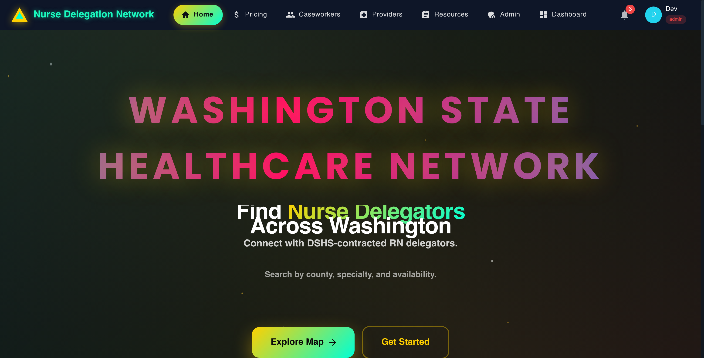
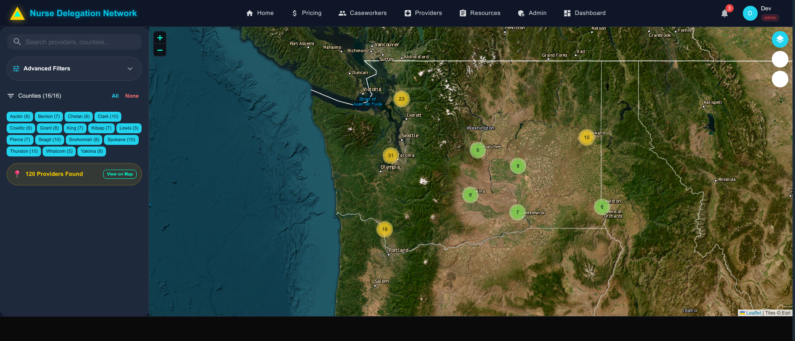
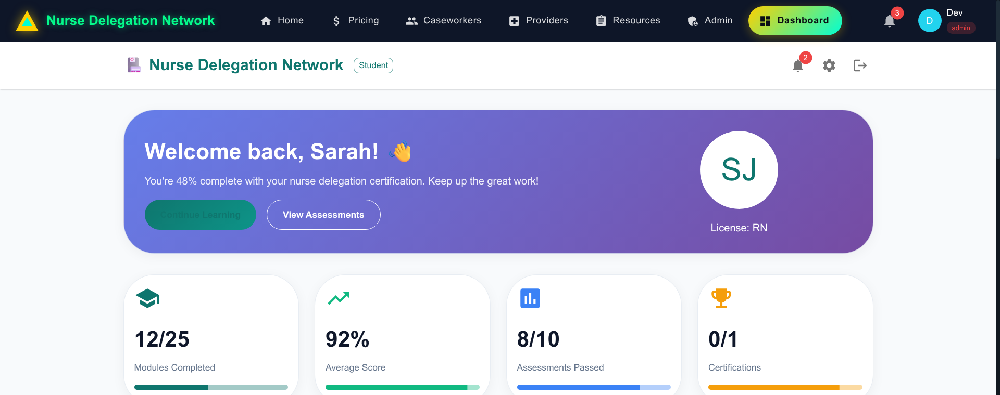

# Nurse Delegation Network

A portfolio demonstration of a searchable nurse-delegation provider directory, interactive service map, role-based workflows, and administration tools.

**[View the live demo on HarpStar](https://harpstarunlimited.com/nurse-delegation/)**

| Landing experience | Provider map | Dashboard concept |
|---|---|---|
|  |  |  |

> **Privacy-safe portfolio edition.** All provider names, phone numbers, emails, and locations are synthetic demo data. Phone numbers use the fictional 555 exchange; email addresses use `example.com` or `nurse-d.org`. No real people's information is included.

Original design studies are available in [`design-mockups/`](design-mockups/).

---

## 1. Project Overview

**Nurse Delegation Network** is a subscription-based platform connecting case workers, DSHS staff, and healthcare organizations with contracted RN nurse delegators across Washington State. The platform provides an interactive provider directory, map-based search, and communication tools to streamline nurse delegation referrals.

### Core Mission
- Lower manual consulting dependency by automating provider discovery
- Create visibility for nurse delegators statewide
- Introduce subscription-based recurring revenue model

### Target User Roles
- **Case Workers**: Find and contact nurse delegators for their clients
- **Nurse Delegator Providers (RN/LPN)**: Get listed in the directory, receive referrals
- **Organizations/Agencies**: Manage team access and compliance
- **Administrators**: Manage providers, users, subscriptions, and content

---

## 2. Design Philosophy & Rationale

### Architecture Principles
- **Subscription-First**: The entire site requires an active subscription (except landing/pricing/legal pages)
- **Admin Always Present**: Comprehensive admin dashboard for full platform control
- **AI-Optional**: Core functionality works without AI; AI features are enhancements, not dependencies
- **Microservices Ready**: Frontend, Backend, and AI services are separated for independent scaling

### Technology Stack
| Layer | Technology |
|-------|------------|
| **Frontend** | React 18 + Vite + TypeScript |
| **Styling** | Vanilla CSS + MUI Components |
| **Backend** | Node.js + Express + TypeScript |
| **Database** | PostgreSQL 15 |
| **Cache** | Redis 7 |
| **Payments** | Stripe Checkout + Customer Portal |
| **AI (Optional)** | Python FastAPI + OpenAI |
| **Deployment** | Docker Compose |

---

## 3. System Architecture & Data Flow

```
┌─────────────────────────────────────────────────────────────────┐
│                         Nurse Delegation Network Platform                           │
├─────────────────────────────────────────────────────────────────┤
│                                                                 │
│   [Public Pages]          [Protected Pages]      [Admin]        │
│   ├── Landing (/-)        ├── Map/Directory     ├── Dashboard   │
│   ├── Pricing             ├── Search            ├── Users       │
│   ├── Login               ├── Profile           ├── Providers   │
│   ├── Register            └── Reports           ├── News        │
│   ├── Terms                                     └── Settings    │
│   └── Privacy                                                   │
│                                                                 │
├─────────────────────────────────────────────────────────────────┤
│                    Backend API (Express)                        │
│   /api/v1/auth      /api/v1/providers    /api/v1/admin         │
│   /api/v1/users     /api/v1/subscriptions  /api/v1/news        │
├─────────────────────────────────────────────────────────────────┤
│   PostgreSQL          Redis Cache          Stripe Webhooks      │
└─────────────────────────────────────────────────────────────────┘
```

### API Endpoints

| Route | Description |
|-------|-------------|
| `/api/v1/auth` | Login, register, password reset |
| `/api/v1/users` | User profile management |
| `/api/v1/providers` | Provider CRUD, county filtering |
| `/api/v1/subscriptions` | Stripe checkout, portal, webhooks |
| `/api/v1/admin` | Dashboard stats, user/provider management |
| `/api/v1/news` | News ticker content |

---

## 4. Component Analysis

### Database Schema (`database/schemas/`)

| File | Purpose | Status |
|------|---------|--------|
| `init.sql` | Core tables (users, orgs, training, certifications) | ✅ Complete |
| `002_providers_subscriptions.sql` | Provider directory, subscriptions, news, settings | ✅ Complete |

**New Tables Added:**
- `providers` - Nurse delegator profiles
- `provider_counties` - Service area mapping (many-to-many)
- `subscriptions` - Stripe subscription tracking
- `news_items` - News ticker content
- `admin_settings` - Key-value site configuration

### Backend Routes (`backend/src/routes/`)

| File | Purpose | Status |
|------|---------|--------|
| `auth.routes.ts` | Authentication endpoints | ✅ Existing |
| `provider.routes.ts` | Provider CRUD, county search | ✅ **New** |
| `subscription.routes.ts` | Stripe integration | ✅ **New** |
| `admin.routes.ts` | Admin dashboard API | ✅ **New** |
| `news.routes.ts` | Public news ticker | ✅ **New** |

### Middleware (`backend/src/middleware/`)

| File | Purpose | Status |
|------|---------|--------|
| `subscription.middleware.ts` | Gates routes by subscription status | ✅ **New** |

### Frontend Pages (`frontend/src/pages/`)

| File | Purpose | Status |
|------|---------|--------|
| `HomePage.tsx` | Landing page with map | ✅ Existing |
| `LoginPage.tsx` | User login | ✅ Existing |
| `PricingPage.tsx` | Subscription plans | ✅ **New** |
| `RegisterPage.tsx` | User registration | ✅ **New** |
| `AdminPage.tsx` | Admin dashboard | ✅ **New** |
| `TermsPage.tsx` | Terms of Service | ✅ **New** |
| `PrivacyPage.tsx` | Privacy Policy | ✅ **New** |

### Frontend Components (`frontend/src/components/`)

| File | Purpose | Status |
|------|---------|--------|
| `InteractiveMapSection.tsx` | Main map with providers | ✅ Existing |
| `WaStateMap.tsx` | Washington state map | ✅ Existing |
| `NewsTicker.tsx` | Animated news banner | ✅ **New** |

---

## 5. Data Schema Guide

### Core Tables (Phase 1)

```sql
-- Providers (from CSV migration)
providers
├── id (UUID)
├── name, display_name, phone, email
├── provider_id (DSHS external ID)
├── is_active, is_verified
└── timestamps

-- Service Areas
provider_counties
├── provider_id (FK)
├── county, lat, lng
└── is_primary

-- Subscriptions (Stripe)
subscriptions
├── user_id (FK)
├── stripe_customer_id, stripe_subscription_id
├── plan (free/basic/pro/enterprise)
├── status (active/canceled/trialing/...)
└── period_start, period_end

-- News/Announcements
news_items
├── title, content, link
├── category, is_active, is_pinned
└── publish_at, expires_at
```

---

## 6. Project Setup & Installation

### Prerequisites
- Docker Desktop installed and running
- Git
- Node.js 18+ (for local development)

### Installation Steps

```bash
# 1. Clone the repository
git clone <repo_url>
cd nurse-d

# 2. Configure environment
cp .env.example .env
# Edit .env with your Stripe keys, database credentials, etc.

# 3. Launch with Docker
docker-compose up -d

# 4. Run database migrations (if needed)
docker exec -it nurse-d-postgres psql -U postgres -d nurse_d -f /docker-entrypoint-initdb.d/002_providers_subscriptions.sql
```

---

## 7. How to Run the Platform

### With Docker (Recommended)
```bash
docker-compose up -d
```

### Access URLs
| Service | URL |
|---------|-----|
| Frontend | http://localhost:3000 |
| Backend API | http://localhost:5000 |
| API Docs | http://localhost:5000/api/docs |
| AI Service | http://localhost:8000 |

### Default Admin Credentials
- **Email**: `admin@nurse-d.org`
- **Password**: `admin123`

---

## 8. Subscription Tiers

| Plan | Monthly | Yearly | Features |
|------|---------|--------|----------|
| **Basic** | $29 | $290 | Map access, Directory search, County filtering |
| **Pro** | $79 | $790 | + Email assistant, Download reports, Priority support |
| **Enterprise** | $199 | $1,990 | + Unlimited team, API access, Custom integrations |

All plans include a **14-day free trial**.

---

## 9. Proposed Conventions & Best Practices

### Code Style
- **Prettier + ESLint** default configurations
- TypeScript strict mode enabled

### Commit Messages (Conventional Commits)
```
feat: add provider search endpoint
fix: correct subscription status check
docs: update README with new routes
```

### Branching Strategy
```
main (production)
  └── develop
       ├── feature/provider-import
       ├── feature/stripe-webhooks
       └── fix/subscription-bug
```

---

## 10. Action Plan & Next Steps

### Phase 1: Foundation ✅ Complete
- [x] Database schema for providers, subscriptions, news
- [x] Provider CRUD API routes
- [x] Subscription routes (Stripe skeleton)
- [x] Admin dashboard routes
- [x] Frontend: Pricing, Register, Admin, Terms, Privacy pages
- [x] News ticker component
- [x] Updated routing in App.tsx

### Phase 2: Database Integration (Next)
- [ ] Connect provider routes to PostgreSQL
- [ ] Migrate CSV data to database
- [ ] Implement actual subscription queries
- [ ] Connect news routes to database

### Phase 3: Stripe Integration
- [ ] Configure Stripe products and prices
- [ ] Implement checkout session creation
- [ ] Set up webhook handlers
- [ ] Add subscription status checks to protected routes

### Phase 4: Admin Enhancements
- [ ] Provider import from CSV
- [ ] User management CRUD
- [ ] News CRUD with publish scheduling
- [ ] Analytics dashboard

### Phase 5: Polish
- [ ] Email notifications (welcome, trial ending)
- [ ] Mobile responsive refinements
- [ ] Performance optimization
- [ ] Security audit

---

## 11. File Structure

```
nurse-d/
├── .env.example           # Environment template (updated with Stripe)
├── docker-compose.yml     # Full stack orchestration
├── README.md              # This document
│
├── backend/
│   └── src/
│       ├── index.ts              # App entry (updated)
│       ├── routes/
│       │   ├── provider.routes.ts     # NEW
│       │   ├── subscription.routes.ts # NEW
│       │   ├── admin.routes.ts        # NEW
│       │   └── news.routes.ts         # NEW
│       └── middleware/
│           └── subscription.middleware.ts # NEW
│
├── frontend/
│   └── src/
│       ├── App.tsx               # Routes (updated)
│       ├── pages/
│       │   ├── PricingPage.tsx        # NEW
│       │   ├── RegisterPage.tsx       # NEW
│       │   ├── AdminPage.tsx          # NEW
│       │   ├── TermsPage.tsx          # NEW
│       │   └── PrivacyPage.tsx        # NEW
│       └── components/
│           └── NewsTicker.tsx         # NEW
│
└── database/
    └── schemas/
        ├── init.sql                   # Core schema
        └── 002_providers_subscriptions.sql  # NEW
```

---

## 12. Contact & Support

**Nurse Delegation Network**

For technical questions, please refer to this documentation or contact the development team.

---

*Last Updated: December 8, 2025*
